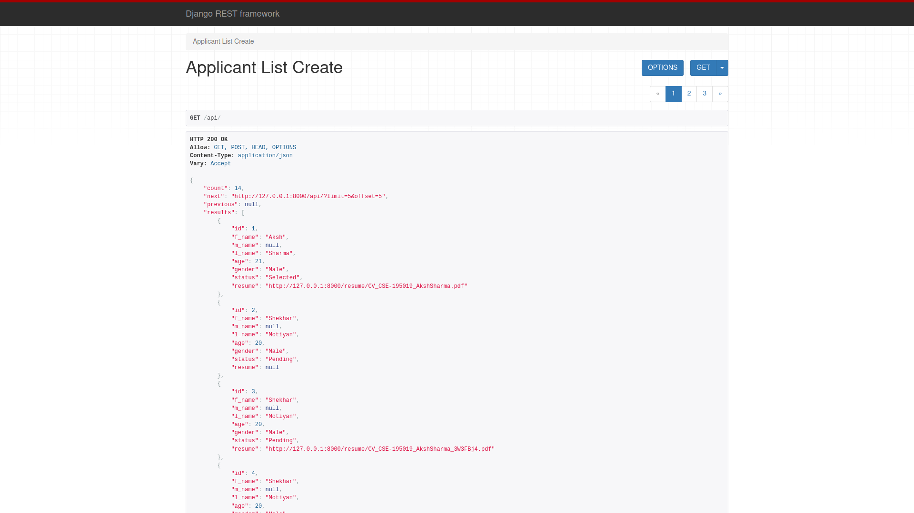
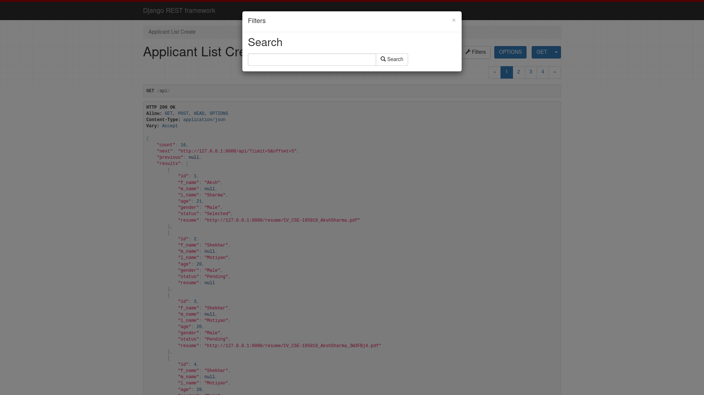
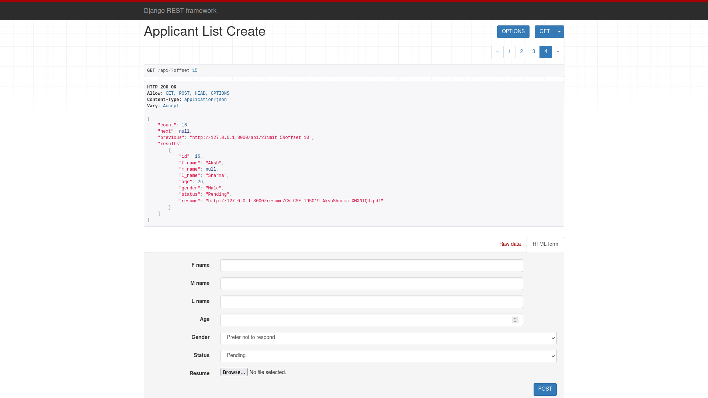
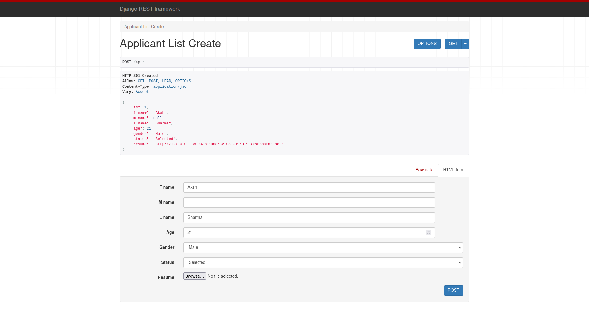
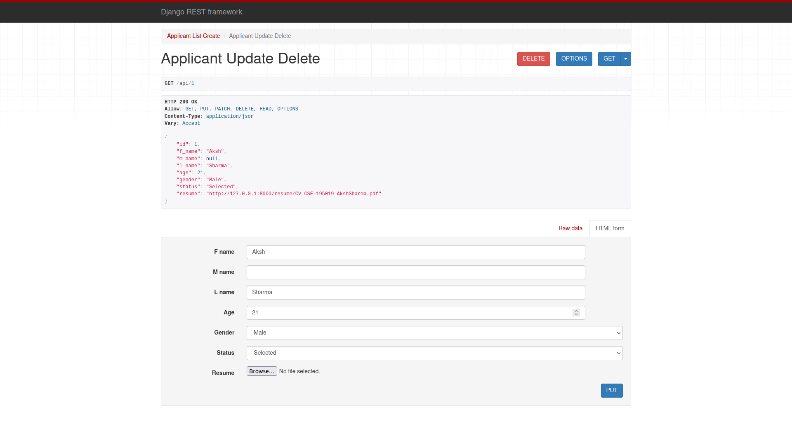

# ApplicantAPI
A rest app for a Job application review system. 
It have api endpoints to create, retrieve, update, delete and list the information of an applicant.
It also have a feature to mark applicants Selected or rejected.
It also have the functionality to upload resumes of the applicant along with rest of the info.
It also have filtering and pagination in the applicant listing api.

# Set Up
1. Clone repo using : ` git clone https://github.com/akshsharma1218/ApplicantAPI`
2. Create virtual enviroment : `python3 -m venv env`   &emsp;&emsp;&emsp; # for linux
3. Change directory : `cd rest_app`
4. Install requirements : `pip install -r requirements.txt`
5. Run migrations : `python3 manage.py makemigrations` 
&emsp;&emsp;&emsp;&emsp;&emsp;&emsp;&emsp;&emsp;`python3 manage.py migrate`
6. Run server : `python3 manage.py runserver`

# Routes :

Home page or list page : `http://127.0.0.1:8000/`   
Particular applicant retrive/update/delete : `http://127.0.0.1:8000/<id>`  &emsp;&emsp;&emsp; # eg : `http://127.0.0.1:8000/1`

# Preview
## Applicant List View with pagignation

## Filtering

## Applicant Create View

## Applicant Created Response

## Applicant Update Delete View

